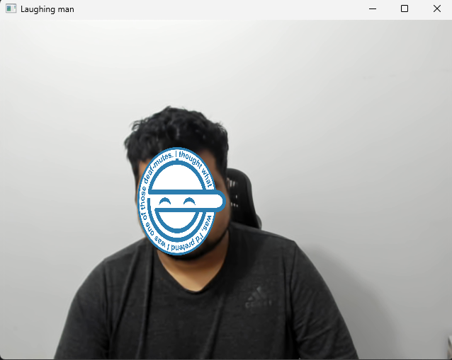

# Laughing man OpenCV

## Overview
This application utilizes advanced computer vision techniques to identify faces in a real-time video stream and then superimposes a sticker (The laughing man) over the detected faces. This can be used for various purposes, including fun filters for video calls, anonymizing people in a video, etc.



## Features
* Real-Time Face Detection: Identifies faces in a real-time video stream.
* Dynamic Sticker Application: Superimposes a sticker on the detected faces.
* Customization: Ability to use custom stickers.

## Prerequisites
Ensure you have the following installed:

* OpenCV 4.8
* Numpy

## Installation
Clone the repository to your local machine:

```bash
git clone https://github.com/gersongams/laughing_man.git
```

## Usage
Run the main script:

```bash
python main.py
```

Press q to exit the application.

To use a custom sticker, replace the sticker.jpg file in the project directory.

## Configuration
You may adjust the confidence thresholds and other parameters within the script to tweak face detection performance and accuracy.